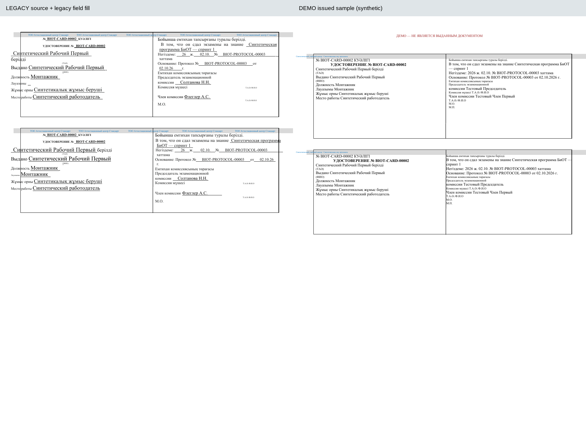
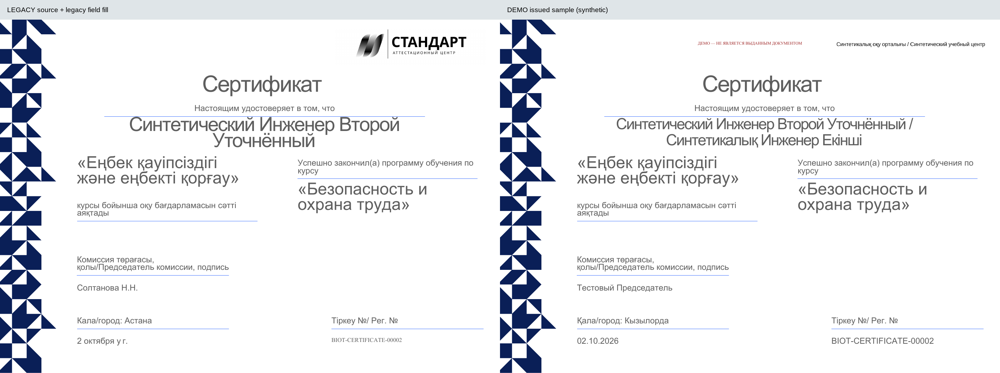
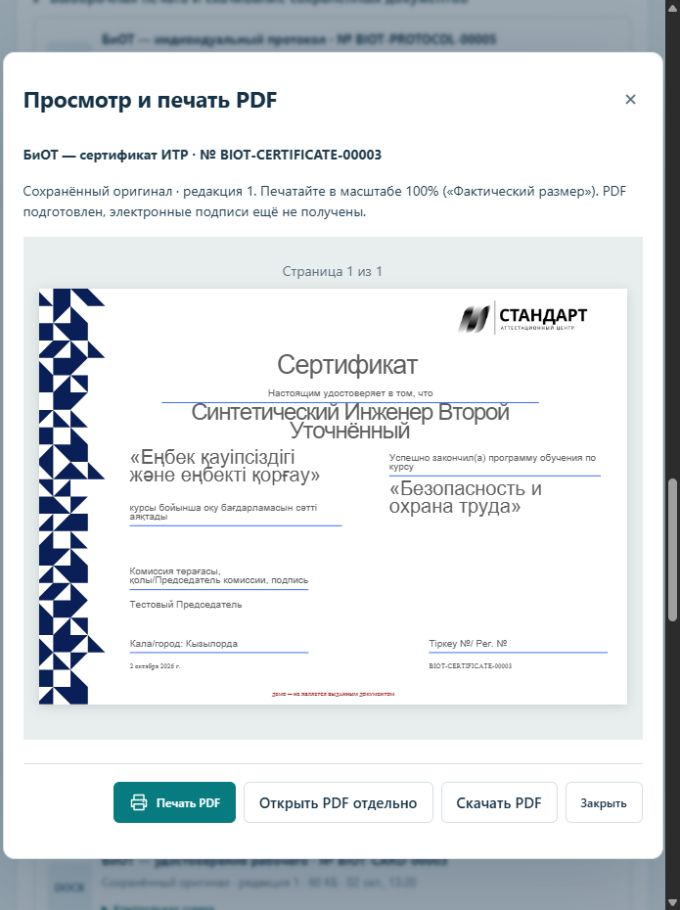
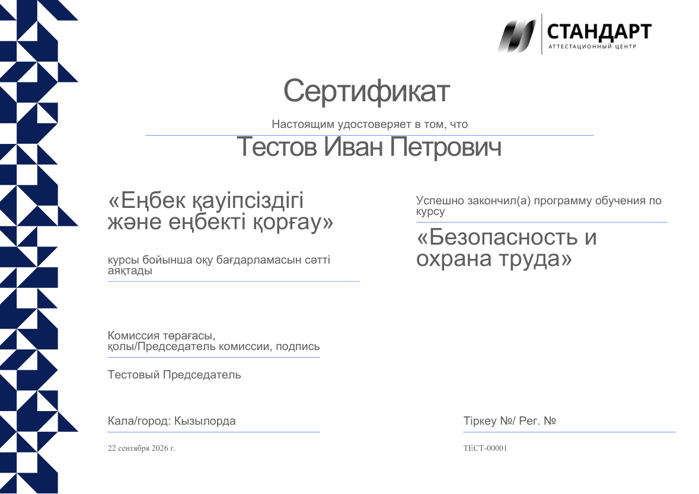

# Сверка печатных форм с опубликованной версией DSJ

Дата: 02.10.2026. Область: автономный `products/demo`, документы БиОТ, ПТМ, ПБ и ПС. Изменение интерфейса заявки в эту работу не входит; его сравнение вынесено в `DEPLOYED_REQUEST_FORM_COMPARISON_2026-10-02.md`.

## Зафиксированные состояния

- Перед началом сравнения текущая работа сохранена локальным коммитом `8825dfa65f6c2a9b38bd39ee44463d3a0f6b102e` (`feat(demo): complete local first product sprint`) в `codex/first-live-iteration`.
- Новая рабочая ветка: `codex/diff-deployed-templates`.
- В интерфейсе Vercel подтверждён источник указанного пользователем домена: проект `dsj-codex-permit-journal-ui-canonical`, Production Ready, ветка `main`, коммит `90d5b5e72dba0ac38c89f42fa37925a0b3468561`, каталог `dsj2/apps/web`, deployment `6vcGVjTZj4JKoxB2Kgiyo4E4cFrS`.
- Исходник развёрнут параллельно для чтения в `C:/Users/Admin/.codex/worktrees/diff-deployed-source/DSJ-codex-PERMIT_JOURNAL_UI_CANONICAL`, detached HEAD на точном production-коммите. Текущая ветка разработки при этом сохранена в рабочем каталоге `ot-center-business-value`.
- Страница сравнения: <https://dsj-codex-permit-journal-ui-canonic.vercel.app/certificates/biot-experimental?companyId=seed-company-biot>. Вход выполнен предоставленной пользователем учётной записью. Секреты не сохранены в отчёте или репозитории.
- Из существующих заявок через штатные ссылки скачаны девять DOCX: удостоверение, сертификат ИТР и протокол БиОТ; удостоверение и протокол ПТМ; удостоверение и протокол ПБ; удостоверение и протокол ПС. Новые заявки на удалённом сайте не создавались. Свидетельство ПС проверяется по исходному DOCX: в раскрытом архиве нет отдельной ссылки на этот документ.
- SHA backend-развёртывания Railway отдельно не установлен. Указанный SHA доказан для Vercel frontend; фактические скачанные DOCX являются отдельным свидетельством выходных файлов backend.
- `git push`, изменение настроек Vercel/Railway и deploy не выполнялись.

## Причина различий

Все десять уникальных исходных DOCX в `dsj2/docs/experimental/{biot,ptm,pb,ps}` совпадают по SHA-256 с исходниками production-коммита. Один исходный протокол БиОТ используется для двух отдельных форм текущего продукта: рабочих и ИТР. Поэтому индивидуальных форм в DEMO одиннадцать.

Проверены также девять скачанных документов: во всех совпадают размеры страниц исходных форм. В пяти полностью совпадает набор геометрии страниц/фигур и SHA изображений; в четырёх добавлено по одному изображению, что изменяет агрегированный набор фигур. Это структурная проверка, не утверждение о пиксельной идентичности Word и LibreOffice. Обезличенные результаты: [production-structure.json](evidence/deployed-template-diff-20261002/production-structure.json), [source-provenance.json](evidence/deployed-template-diff-20261002/source-provenance.json). Сами скачанные документы с данными людей остаются только в локальном ignored runtime.

Проблема находится в преобразовании и заполнении шаблонов. Сохранённые размеры страниц и координаты фигур сами по себе ещё не доказывают совпадение готового документа.

| Элемент | Исходная версия | DEMO до исправления |
|---|---|---|
| Текст удостоверений | Исходные абзацы, шрифты, подчёркивания и табуляция | Общая функция пересобирает абзацы, ставит 8/6 pt и меняет интервалы |
| Сертификат ИТР | Крупное ФИО в исходной композиции | Объединение RU/KZ имени и принудительная подгонка меняют размер и расположение |
| Изображения издателя | Логотипы и другие изображения из исходного пакета | Байты идентификационных изображений заменены; поверх выводится название текущего центра |
| Дата | В исходнике встречаются поля Word DATE | Новая версия фиксирует назначенную дату и различает дату протокола и выдачи |
| Длинные данные | Исходный макет может переполняться | Подгонка предотвращает часть переполнений, но слишком сильно меняет весь текст |
| Тестовая отметка | Отсутствует в исходной форме | Включается для тестового комплекта; добавление абзаца в заголовок может сдвигать макет |

Ниже — сравнение одного и того же синтетического набора данных: слева исходный DOCX, заполненный старым генератором локально; справа сохранённый PDF DEMO до исправления. Это не скриншоты персональных документов с production. Конвертация выполнена локальным LibreOffice, поэтому она также показывает ограничения старого pipeline: переполнение длинного имени и автообновление поля DATE.

## Границы восстановления

Используются сами исходные DOCX и оригинальный способ их заполнения из `90d5b5e`. Их оформление, графика, шрифты, рамки и расположение элементов не пересоздаются. Шаблоны «Аттестационного центра Стандарт» сохраняются в том виде, который пользователь указал как правильный. Текущий продукт передаёт в предусмотренные поля сохранённые сведения о получателе, даты, номера и данные обучения.

Тестовый комплект остаётся обозначенным как тестовый; эта отметка относится к режиму данных и не должна менять исходную вёрстку. Старые выпуски и закреплённые файлы не перезаписываются.

## Как изменено заполнение

Прежняя цепочка сначала преобразовывала исходный бланк: заменяла шрифты и изображения, объединяла RU/KZ значения, переписывала отдельные абзацы и затем подгоняла их. Промежуточный `SOURCE_FIDELITY_V2` продолжал адаптировать вёрстку и поэтому не принят как выполнение запроса.

Исправленный путь `LEGACY_REFERENCE_90D5` использует отдельные копии исходных файлов, совпадающие по SHA-256 с источником, и локальные копии его генераторов. Он обходит преобразователь `prepare_original` и функции подгонки шрифта, отступов и текстовых рамок. Код автономен: импортов runtime DSJ нет. Данные из сохранённого выпуска подставляются в существующие поля; отдельные даты выдачи и протокола должны сохранять свой смысл, а поле Word DATE не должно подменять их текущей датой.

Текстовые реквизиты, которые в исходнике записаны обычными словами, заполняются отдельно в существующих текстовых узлах: сведения центра, адрес и БИН, комиссия, директор, город и основание. Основание в текущем профиле — свободный текст; из него не выдумываются дата или номер приказа. Ссылки на нормативные документы, в частности Закон РК 2014 года в ПБ, сохраняются. Внутренние приказы из образца не выдаются за фактические реквизиты текущего центра.

В групповом протоколе используется фактический результат участника. Статусы «Не сдал», «Не явился» и «Не подтверждено» не могут превратиться в сохранённую оценку «Хорошо». Значения соответствуют заголовкам исходных колонок: в БиОТ/ИТР примечание получает сохранённое примечание, подпись ПТМ остаётся пустой, номер удостоверения ПС берётся из отдельного номера удостоверения. Колонки номера удостоверения в БиОТ/ИТР, ПТМ и ПБ не добавляются. Для больших групп неизменные изображения упаковываются один раз, а строки заполняются теми же исходными функциями: идентичность XML проверена для пяти видов протокола и разных результатов.

## Состав документов

Сертификат не является универсальным приложением к каждому удостоверению. Текущая модель комплектов различает:

| Направление | Основные формы |
|---|---|
| БиОТ, рабочие | Удостоверение + протокол |
| БиОТ, ИТР | Сертификат ИТР + отдельный протокол ИТР |
| ПТМ | Удостоверение + протокол |
| ПБ | Удостоверение + протокол |
| ПС | Удостоверение + свидетельство + протокол |

Протокол может быть общим на группу или отдельным на человека согласно настройке обучения. В этой работе состав комплектов не меняется.

## Проверка реализации

Статус: **ORIGINAL_FORMS_RESTORED_LOCAL_ENGINEERING_PASS**. Прямой перенос, независимое сравнение, полный локальный контрольный комплект и окончательный общий `test:render` завершены. Приёмка качества печати отделена от сохранности исходника: `NOT_ACCEPTED_SOURCE_LIBREOFFICE_LIMITS`. Промежуточная приёмка V2 остановлена. Эти 16 версий успели зарегистрироваться только в локальной базе `demo_test_first_live_ui` на `127.0.0.1:55439`; с ними не создано ни одного выпуска или render snapshot. Они не удаляются и не перезаписываются: для прямого переноса используются следующие версии.

| Форма | Выбранная исходная версия |
|---|---|
| БиОТ, удостоверение рабочего | 20 |
| БиОТ, сертификат ИТР | 18 |
| БиОТ, протокол рабочего / ИТР | 14 / 5 |
| ПТМ, удостоверение / протокол | 17 / 12 |
| ПБ, удостоверение / протокол | 17 / 12 |
| ПС, удостоверение / протокол / свидетельство | 18 / 12 / 14 |
| Групповые протоколы БиОТ / остальных направлений | group-v5 / group-v4 |

Новые пакеты побайтно равны исходным DOCX. Контрольные суммы файлов и оригинальных генераторов сохранены в `assets/templates/legacy-reference-provenance.json`. Политика рендера выбирается по закреплённым байтам и типу шаблона, поэтому исторические версии продолжают использовать прежний механизм.

Выполненные проверки исправленного пути:

- **11/11 индивидуальных форм:** заполнение исходным генератором и адаптером даёт одинаковые части DOCX, включая текст, стили, связи и изображения. Исключение сравнения — только служебное время изменения в `docProps/core.xml` у свидетельства ПС.
- **11/11 форм:** независимая проверка подстановки текущих данных сохраняет свойства текста и абзацев, рамки, таблицы, размеры страниц и изображения. Разрешены только значения текстовых узлов, удаление активных инструкций поля DATE и заполнение одного предусмотренного пустого поля месяца свидетельства.
- **Удостоверение рабочего и сертификат ИТР:** контрольный и фактический PDF совпадают по количеству страниц, тексту, шрифтам и координатам текста, изображений и линий с точностью 0,0001 pt. Это сравнение двух путей через один LibreOffice; оно не доказывает совпадение LibreOffice с Microsoft Word или физическую печать.
- **Данные:** проверены независимые даты выдачи, протокола и срока действия, две разные записи в пакете, обе KZ-должности рабочего, фактические PASSED/FAILED в протоколах и дата решения свидетельства ПС.
- **Окончательная генерация:** все действующие формы и три варианта с фото прошли реальное преобразование DOCX → PDF. Пакеты из двух получателей и ста отдельных протоколов прошли проверку DOCX/PDF; в последнем присутствуют все сто имён и соответствующие номера протоколов.
- **Код продукта:** `pnpm test` — 137 root + 111 web = **248 PASS**, 0 fail/skip; lint, typecheck печатного пакета и проверка автономности PASS.
- **Полный окончательный renderer-набор:** `pnpm test:render` — **90/90 PASS**, 0 failures/errors/skips, 988,675 с, exit 0. Включает текущие исходные формы, фото, пакет из ста протоколов, DOCX на 250 человек, проверки прежних шаблонов и структуры файла. [Итог локальной проверки](evidence/deployed-template-diff-20261002/engineering-verification.json).

Фото вставляется исходным генератором в его прежнее место. Проверка обнаружила несовместимость его двух служебных XML с LibreOffice после добавления фото и при объединении нескольких документов. В исправленном адаптере `[Content_Types].xml` и `word/_rels/document.xml.rels` получают стандартную сериализацию пространства имён; их содержимое, цели связей и атрибуты сохраняются. Отдельно название кодировки `utf8` приводится к `UTF-8`, а потерянные объявления совместимости XML восстанавливаются из того же закреплённого исходного DOCX. Порядок элементов, их значения, свойства текста, геометрия и все изображения остаются прежними. Сам исходный DOCX и три исходных генератора не изменены.

Причина отказа LibreOffice подтверждена неизменённым и исправленным файлами по одному короткому пути, отдельно для фото и двух документов в пакете. Проверка структуры конечного DOCX проходит для всех одиннадцати форм в тестовом режиме. Эти изменения относятся к упаковке файла; подгонка макета не выполняется.

Отдельная синтетическая PDF-проверка охватила **14 вариантов / 20 страниц**: одиннадцать форм и три удостоверения с фото. Исходные изображения и подстановка данных проверены; на всех двадцати страницах видна тестовая отметка. Текущий групповой БиОТ на **250 человек / 12 страниц** содержит каждое имя ровно один раз, последовательность 1–250, фактические отрицательные результаты и сохранённые примечания. Комиссия находится после списка участников. Это отдельная проверка текущего исходного шаблона; историческая матрица пяти протоколов V1 не выдаётся за проверку текущих пяти групповых шаблонов.

Оба PDF-набора были построены до заключительного исправления только объявлений XML. На окончательном коде отдельно подтверждены неизменность элементов XML, стилей и изображений во всех четырнадцати вариантах, независимое заполнение всех одиннадцати форм, фактическая конвертация пакета из двух документов и совпадение координат PDF удостоверения ПБ с фото до/после исправления с точностью 0,0001 pt. Полный набор визуальных страниц после этого служебного исправления повторно не заявляется. Точные SHA и границы проверки: [PDF-проверка](evidence/deployed-template-diff-20261002/pdf-review.json), [совместимость пакетов](evidence/deployed-template-diff-20261002/package-compatibility.json).

## Контрольный комплект в приложении

Создана отдельная синтетическая заявка [5dcf2386-a357-472d-928b-041b4466c1f6](http://localhost:3132/requests/5dcf2386-a357-472d-928b-041b4466c1f6/edit): рабочий БиОТ и ИТР, удостоверение и сертификат с двумя протоколами. Согласование директора и подготовка менеджером прошли через существующие сервисы. Четыре документа выбрали новые исходные версии; готовы четыре DOCX, четыре PDF и служебные файлы комплекта. Состояние — `AWAITING_SIGNATURE`, все десять заданий завершены. Это тестовый комплект с явной пометкой DEMO, без заявления об электронной подписи или официальной выдаче.

В браузере открыты удостоверение рабочего (2 страницы) и сертификат ИТР (1 страница). Оба PDF скачаны штатной кнопкой; SHA-256 загрузок равны SHA-256 сохранённых артефактов. [Доказательство проверки в браузере](evidence/deployed-template-diff-20261002/browser-verification.json).

Файлы ранее подготовленных заявок не заменяются. Поэтому просмотр прежней заявки показывает её закреплённые документы; результат новых шаблонов открыт в отдельной контрольной заявке. Один неудачный технический черновик проверки архивирован штатным согласованием; исходные заявки первого спринта не изменялись.

Контрольный сертификат с синтетическими данными после прямого подключения исходника:

Проверка исходной истории: 20 сохранённых наборов входных данных воспроизвели прежние DOCX побайтно; отдельно совпали 16 контрольных DOCX старых форм. На окончательном коде повторно подтверждена сохранность 52 ранее созданных файлов и 32 прежних версий шаблонов. Все 38 DOCX, существовавших в Git до этой работы, не изменены. [Повторная проверка истории](evidence/deployed-template-diff-20261002/immutable-final.json), [независимая проверка выбранных шаблонов и границ изменений](evidence/deployed-template-diff-20261002/scope-review.json). Эти результаты не объявляются приёмкой качества печати новых форм.

## Ограничения исходного оформления в PDF

Проверка исходника и подстановки данных не равна приёмке всех печатных страниц. При преобразовании исходных бланков через LibreOffice воспроизводятся следующие ограничения:

- Длинное имя в удостоверении рабочего может выйти за рамку. Это воспроизводится прямым исходным генератором.
- В удостоверении ПБ часть текста начинается на 2,1 pt левее границы листа. Отдельный контроль исходного генератора без адаптера и тестовой отметки воспроизвёл то же положение.
- В удостоверении ПС фрагмент серой полосы выходит за правый край; исходное место фотографии пересекает область текста примерно на 7,35 pt. В свидетельстве ПС название месяца на казахском переносится на две строки, а исходная графика печатей/подписей пересекает нижние строки.
- Исходный групповой ПТМ не повторяет заголовки таблицы на следующих страницах. Прежние тесты повторяемых заголовков и изменённых ширин относятся к сохранённой версии V1; для прямого переноса проверяются исходная геометрия и сохранность списка участников.

Эти особенности явно сохранены в доказательствах, а шрифты и геометрия для их сокрытия не переделываются. DOCX использует запрошенный исходный макет; совпадение отображения LibreOffice с Microsoft Word и физическая печать не подтверждены. Изображения печатей/подписей — часть исходной графики, а не подтверждённая электронная подпись. Новых push/deploy нет.
